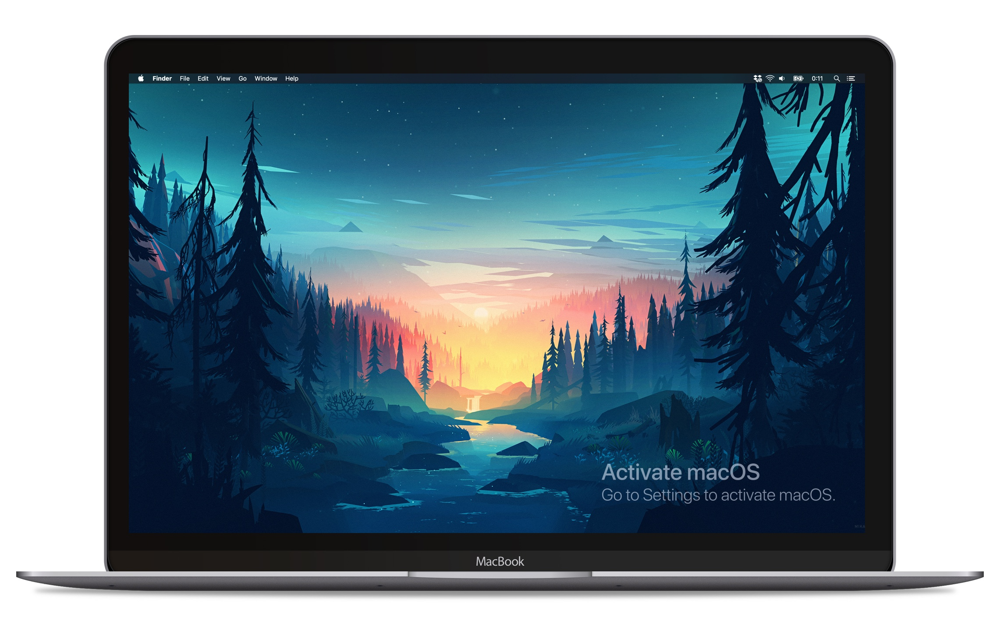

# Activate Windows. For Mac.

### **[Download the App >](https://github.com/Aerolab/activate-mac/raw/master/dist/Activate%20macOS-1.0.0.dmg)**

**macOS** is one of the best operating systems around, but we've always felt it was missing something special, something that makes you feel both like a badass hacker and a cheapskate at the same time.

To solve this problem we've created a brand new way to experience the best feature from Windows: **The Activate Windows** prompt. 

**Activate macOS** has a plethora of great features, including:

* It overlays all your apps, displays and workspaces for maximum immersion.
* Doesn't actually do anything.
* Built using Electron, so it somehow uses half your RAM.
* We believe you should be truly and deeply commited to the apps that you open, so you can't close it.

## Why?

I blame alcohol and a bad sense of humor.

## Dev instructions

No idea why you'd want to do this, but after cloning this repo run

`npm install` to install the dependencies

`npm run dev` to start your "dev" environment with no live reload or anything even remotely useful because the app just shows a single crappy PNG.

## Building the app

`npm run dist` will build the app and a fresh copy should appear in the dist folder.

## How do I actually close this?

Not sure why you'd want to close this magnificent piece of engineering, but you can go to Activity Monitor and Force Quit the app from there.

## License

[MIT](LICENSE)
